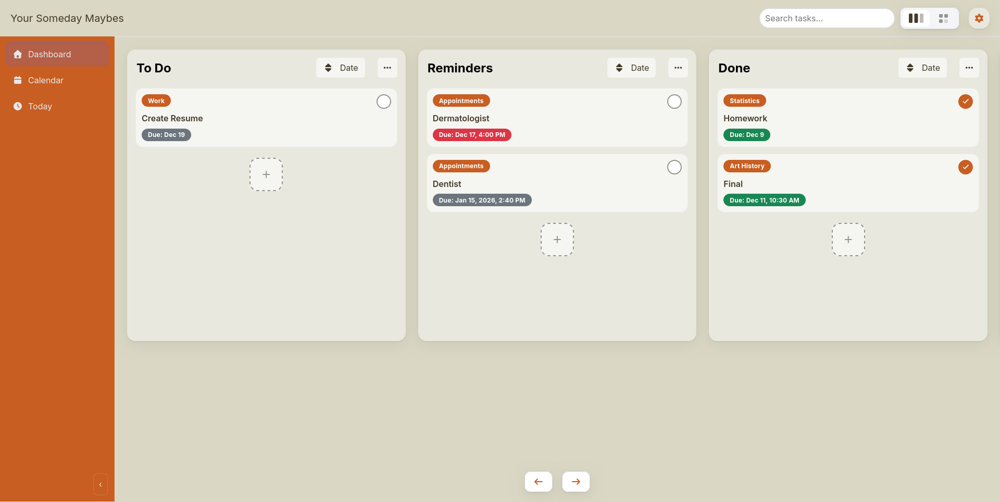
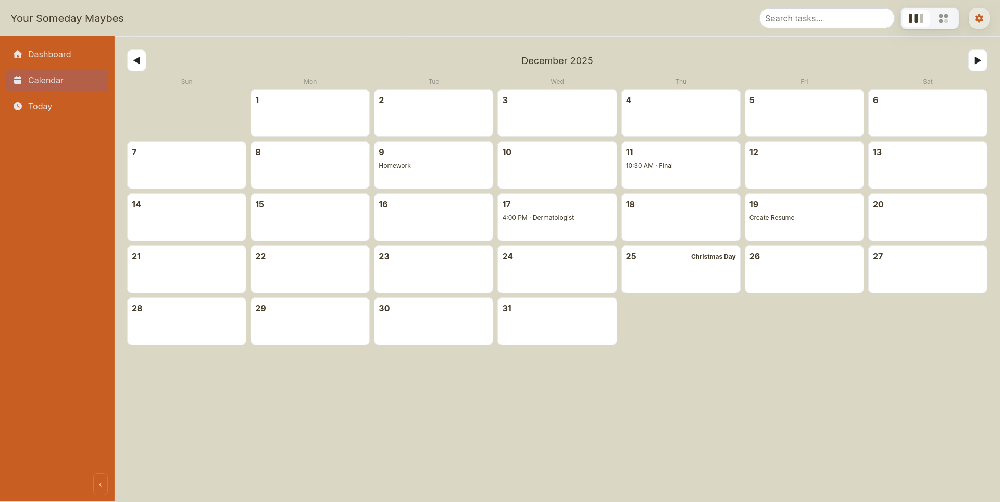
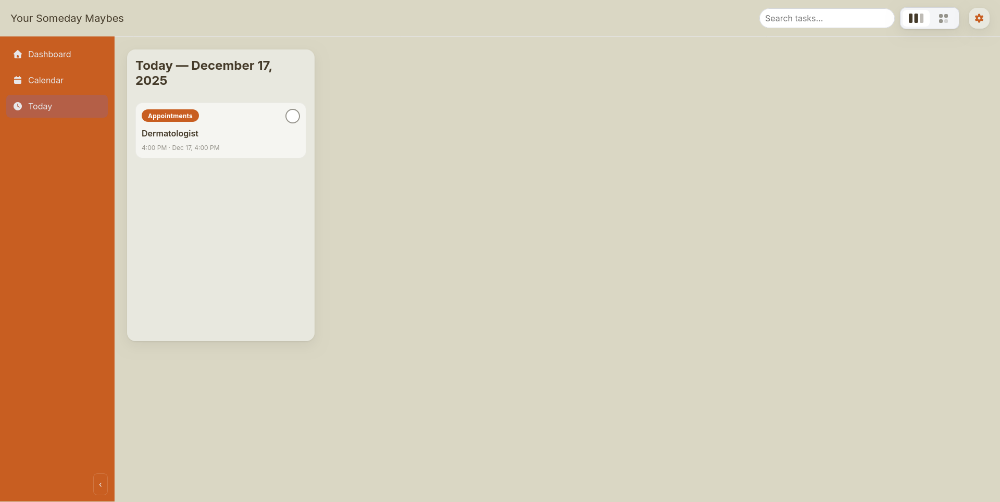
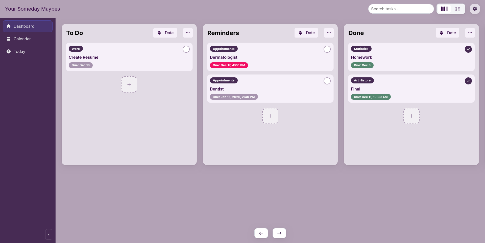
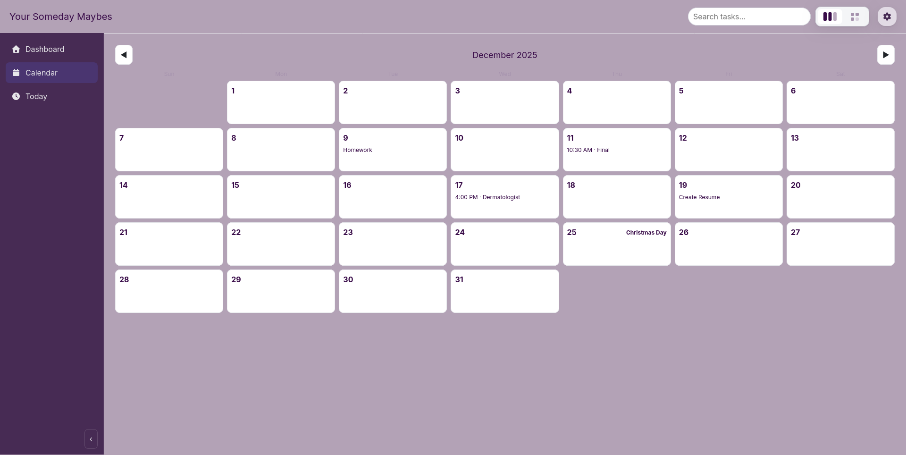
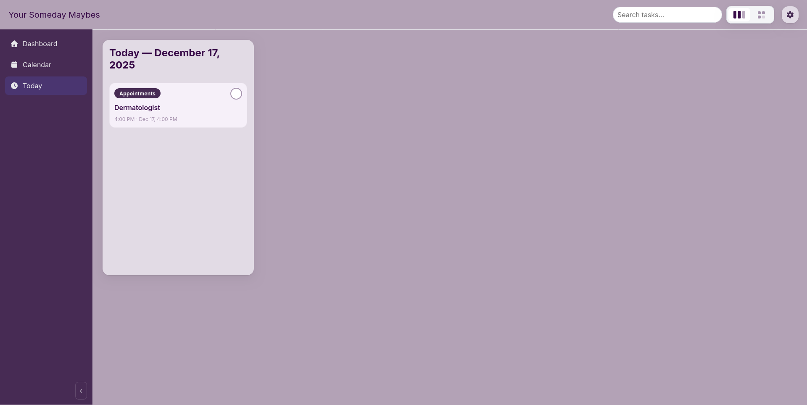

# Someday Maybe

A simple Kanban board with an integrated calendar that stores cards in local storage.

# Usage

This uses vanilla JS, CSS, and HTML, so just host the directory and open the file.
The site may also be available at `https://w3stu.cs.jmu.edu/craigbh/cs343/someday-maybe/`.

# Gallery

    
    
    

    
    
    

 
